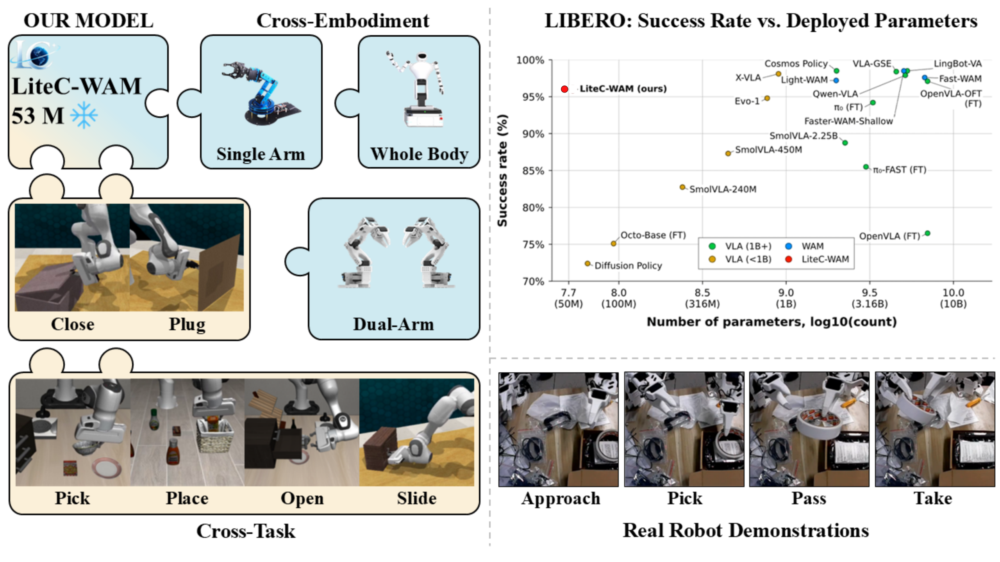
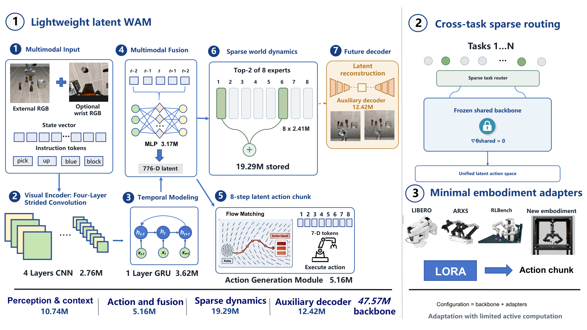
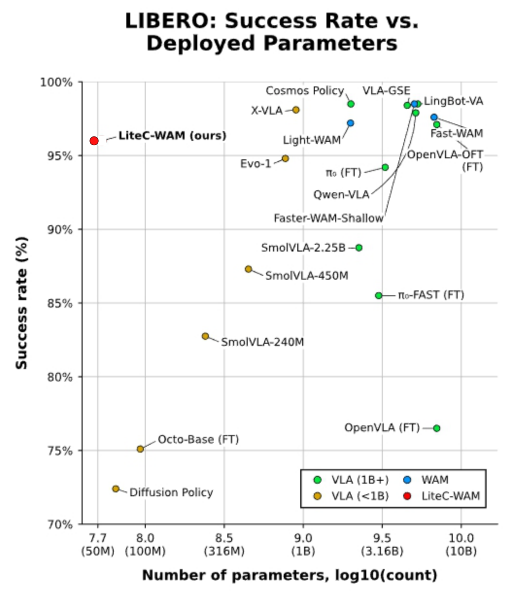
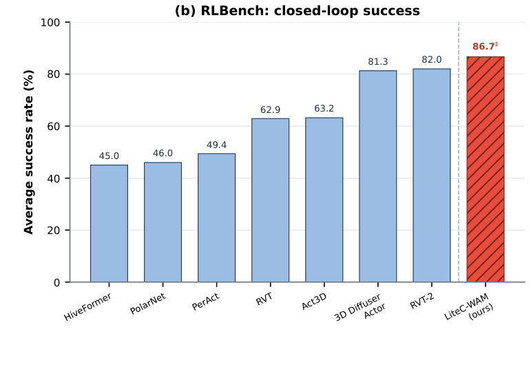
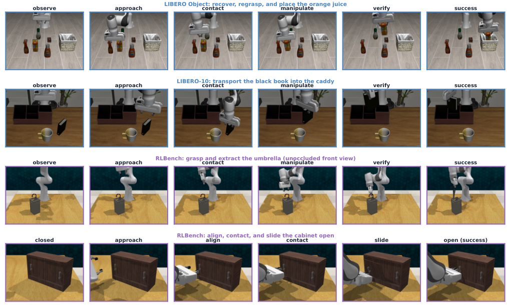
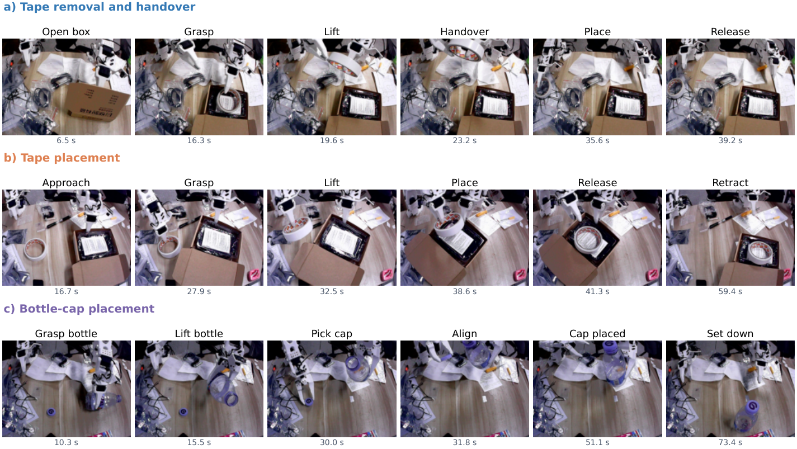

<h1 align="center">LiteC-WAM</h1>
<h3 align="center">A Lightweight Cross Task and Embodiment World Action Model</h3>

<p align="center">
  <a href="#getting-started"></a>
  <a href="#results"></a>
  <a href="docs/protocols.md"></a>
  <a href="LICENSE"></a>
</p>

<p align="center">
  <a href="#method">Method</a> ·
  <a href="#results">Results</a> ·
  <a href="#getting-started">Getting started</a> ·
  <a href="docs/protocols.md">Evaluation protocols</a>
</p>

<p align="center">
  
</p>

**LiteC-WAM** combines action generation and action-conditioned future prediction in a **47.57M-parameter shared backbone**. Sparse dynamics experts and embodiment-specific adapters support manipulation across tasks and robot interfaces. We evaluate the model in LIBERO and RLBench, on ARX5 recorded trajectories, and through physical bimanual execution on SO-ARM101.

*Figure 1 from the paper. The 53M schematic label rounds the ARX5 configuration (53.10M); the LIBERO result uses the 47.57M base model. Whole-body transfer is a design illustration, not an evaluated setting. Benchmark protocols are described below.*

## Method

<p align="center">
  
</p>

The model encodes visual history, robot state, and instructions to generate eight-step action chunks. A top-2-of-8 dynamics module predicts action-conditioned transitions; world-model feedback supplies dynamics residuals, routing weights, and predicted events to the action head.

ARX5 and RLBench adaptation keep the shared backbone frozen and add 5.53M and 6.98M parameters, respectively. SO-ARM101 refinement freezes the visual encoder while updating shared dynamics and embodiment modules.

## Results

### Simulation

<p align="center">
  
  
</p>

- **LIBERO: 96.0% (48/50).** Five selected tasks with ten fixed initial states per task, using the base model without the additional feedback head.
- **RLBench: 86.67% (104/120).** Fifteen tasks with eight fixed seeds per task, using the 54.55M configuration. These tasks were used during development.

The figures place our results alongside published baselines for context. Our selected-task protocols differ from the standard benchmark protocols, so these comparisons do not establish a matched leaderboard ranking. Both simulators use Franka Panda; this comparison evaluates environment and interface transfer.

<p align="center">
  
</p>

*Recorded rollouts: regrasping an object, transporting a book, extracting an umbrella, and sliding a cabinet open.*

### Real-robot execution

<p align="center">
  
</p>

We evaluate three bimanual tasks in **65 physical trials** on SO-ARM101:

- **Tape removal and handover:** 18/20 successes (90.0%).
- **Tape placement:** 26/30 successes (86.7%).
- **Bottle-cap placement:** 10/15 successes (66.7%); the task does not require tightening the cap.

The figure shows original camera frames from recorded policy executions. These rates measure physical task completion. Prediction-error analyses on recorded trajectories are reported separately in the paper.

### Feedback and adaptation

In a controlled LIBERO study with 20 tasks, six training seeds, and four initial states per task, world-model feedback improves success from **319/480 to 353/480 (+7.08 percentage points)**. The paired episode test gives *p* = 0.000588; five of six seeds improve, with seed-level sign-test *p* = 0.219. This study is separate from the five-task result above. Adding feedback to that five-task policy gives 47/50, versus 48/50 with feedback zeroed.

For ARX5, the seven-task equal-weight average is **91.86% episode agreement** on a validation set used for model selection. This measures thresholded action agreement with recorded trajectories, not physical task completion. See [evaluation protocols](docs/protocols.md) for the definitions and statistical details.

## Getting started

This release provides the **evaluation utilities, reported aggregate counts, and policy interface specification**. The core model, training pipeline, checkpoints, raw recordings, and hardware-control code are not included; see [release scope](docs/release_scope.md).

Download the repository and run the following commands from its root with Python 3.10 or newer:

```bash
python -m pip install -e .
python -m litec_wam_public.report --results data/paper_results.json
python examples/inspect_policy_interface.py
python -m unittest discover -s tests -v
```

The report recomputes success rates, Wilson confidence intervals, the ARX5 task average, and paired tests from the published counts. The interface example checks input/output dimensions. Neither command runs the learned policy or generates new rollouts.

## Citation

```bibtex
@misc{litecwam2026,
  title = {LiteC-WAM: A Lightweight Cross Task and Embodiment World Action Model},
  author = {Anonymous Authors},
  year = {2026},
  note = {Anonymous manuscript}
}
```

## License

The released code is available under the [MIT License](LICENSE).
