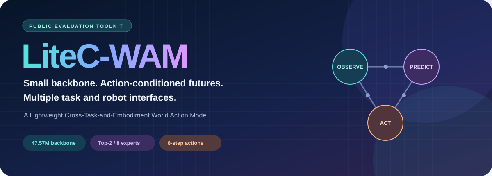
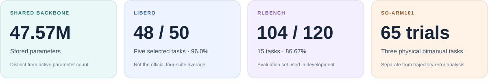
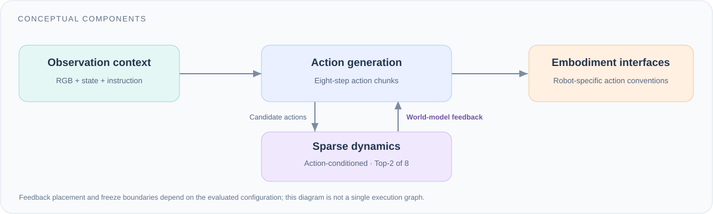

<p align="center">
  
</p>

<p align="center">
  <strong>Observe the scene. Predict the change. Generate the action.</strong><br>
  A Lightweight Cross-Task-and-Embodiment World Action Model
</p>

<p align="center">
  <a href="#quick-start">Quick start</a> ·
  <a href="#the-model">The model</a> ·
  <a href="#evidence-and-scope">Results</a> ·
  <a href="docs/protocols.md">Protocols</a> ·
  <a href="docs/release_scope.md">Release scope</a>
</p>

## A small backbone, several robot interfaces

LiteC-WAM brings action generation and action-conditioned future prediction into a compact shared backbone. Sparse dynamics experts, explicit world-model feedback, and embodiment-specific interfaces connect the design to manipulation across simulation and bimanual physical tasks.

**This repository contains the public evaluation toolkit and review documentation.** It recomputes reported statistics and documents the policy interface. The learned policy implementation, training pipeline, checkpoints, raw recordings, and robot-control stack are not included. This release does **not** independently reproduce policy training or benchmark rollouts.

<p align="center"></p>

## Quick start

Python 3.10 or newer is sufficient for the evaluation utilities. No GPU, simulator, or robot connection is required.

Download this repository and run from its root:

```bash
python -m pip install -e .
python -m litec_wam_public.report --results data/paper_results.json
python examples/inspect_policy_interface.py
python -m unittest discover -s tests -v
```

The report recomputes Wilson confidence intervals, the ARX5 equal-task average, the feedback gain, and paired statistical tests from the included **reported aggregate counts**. It does not simulate new episodes or construct missing trial logs.

## The model

<p align="center"></p>

- 🟦 **Compact perception and control.** A 47.57M-parameter backbone combines visual history, proprioception, instructions, and eight-step action chunks.
- 🟪 **Sparse dynamics.** Top-2-of-8 expert routing limits active dynamics computation. Stored parameters, task-specific configuration size, and active parameters are different quantities.
- 🟧 **Feedback to actions.** The tested feedback input combines dynamics residuals, routing weights, and predicted events. Its effect is measured separately from the five-task headline result.
- 🟩 **Embodiment-specific adaptation.** ARX5 and RLBench keep the shared backbone frozen. The SO-ARM101 refinement freezes the visual encoder while updating shared dynamics and embodiment modules.

The public `Policy` protocol in [`src/litec_wam_public/interface.py`](src/litec_wam_public/interface.py) documents input and output dimensions. It is an integration contract, not a replacement implementation of the learned model.

## Evidence and scope

### 🟦 Simulation

**LIBERO: 48/50 (96.0%).** Five selected tasks, ten fixed initial states each, with the 47.57M base checkpoint and no additional feedback head. This is not the official four-suite average.

**RLBench: 104/120 (86.67%).** Fifteen tasks with eight fixed seeds each, using a 54.55M selected-task configuration. The set was used during development and differs from the standard leaderboard protocol. Both simulation environments use Franka Panda; this comparison tests environment and interface transfer.

### 🟧 Physical bimanual execution

The SO-ARM101 policy was evaluated in **65 physical trials** across three tasks:

- Tape removal and handover: **18/20**.
- Tape placement: **26/30**.
- Bottle-cap placement: **10/15**; tightening the cap is not required.

These are physical completion counts. Recorded-trajectory prediction errors are a separate analysis and are not task-success criteria. The toolkit includes the reported counts, not recordings of every trial.

### 🟪 Controlled feedback study

Across 20 LIBERO tasks, six independently trained seeds, and four initial states per task, feedback gives **353/480** successes versus **319/480** with its input zeroed: **+7.08 percentage points**. Weights, tasks, and initial states are matched; subsequent closed-loop trajectories may diverge.

Five of six seeds improve; the seed-level sign test is not significant (`p = 0.219`). The intervention supports this feedback input under the tested conditions, but does not isolate future-prediction semantics from its other information. Adding the feedback head to the separate five-task policy gives **47/50**, compared with **48/50** when feedback is zeroed.

### 🟩 ARX5 offline agreement

Seven validation tasks yield **91.86%** equal-task episode agreement. An episode passes when at least 95% of sampled windows meet first-step joint/gripper error thresholds. The validation set was used for model selection. This is offline action agreement, not physical task success.

See [the complete protocol notes](docs/protocols.md) for denominators, units, parameter accounting, and interpretation limits.

## What you can reproduce here

- Recompute rates and 95% Wilson intervals from reported successes and trial counts.
- Check the seven-task ARX5 macro average without confusing it with a pooled rate.
- Recompute the exact paired McNemar and seed sign tests from published counts.
- Inspect and validate the documented action dimensions for each embodiment.

The repository does not provide executable training, model inference, simulation rollout generation, or live hardware control. Missing components are listed in [release scope](docs/release_scope.md); no mock policy is presented as LiteC-WAM.

## Citation and review version

This version omits author names, affiliations, contact details, institution branding, and links to author profiles. A hosting account may still identify its owner: **an account-owned GitHub URL is not an anonymous review URL**. Use a separately verified anonymous snapshot or supplementary ZIP when sharing with reviewers.

```bibtex
@misc{litecwam2026,
  title = {LiteC-WAM: A Lightweight Cross-Task-and-Embodiment World Action Model},
  author = {Anonymous Authors},
  year = {2026},
  note = {Anonymous manuscript}
}
```

## License

The code included in this release is provided under the [MIT License](LICENSE). This license does not grant access to, or rights over, withheld implementation files, weights, datasets, or third-party benchmark assets.
